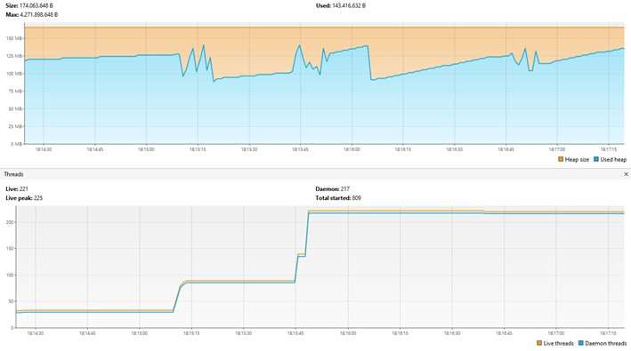
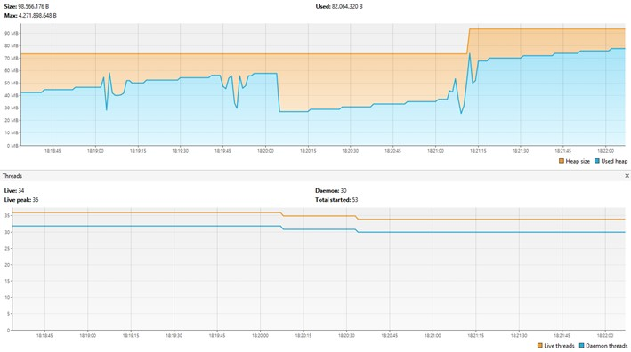

# Desafio 03

 
A imagem acima refere-se ao VisualVM medindo o desempenho do servidor durante as requisições
para o spring-mvc. As três faixas de irregularidade no gráfico indicam cada um dos rounds de
requisições. Simulando 500, 1000 e 2000 usuários virtuais, respectivamente. Neste caso, pode-se
perceber que ocorreu um uso de memória e de Threads elevado.
 
 
 

 
Já a segunda imagem, diz respeito ao VisualVM medindo o desempenho do servidor durante as requisições
para o spring-webflux. Aqui também há três faixas de irregularidade onde indicam cada um dos rounds
de requisições também para 500, 1000 e 2000 usuários virtuais, respectivamente. Diferente do mvc,
neste caso o uso de memória e de threads foi bem menor, o que mostra a eficiência do método em relação
ao anterior.
